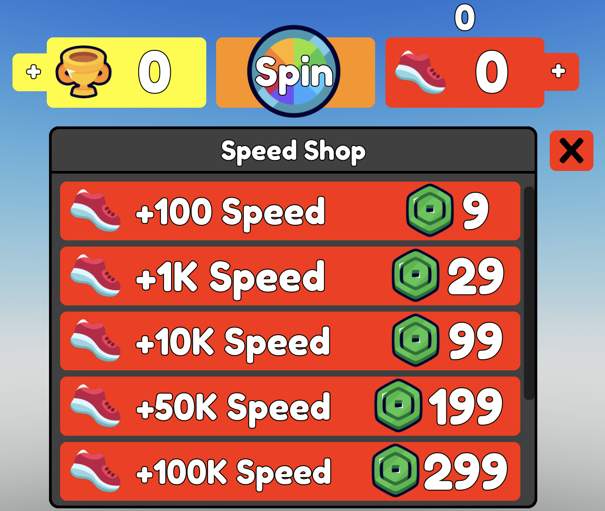
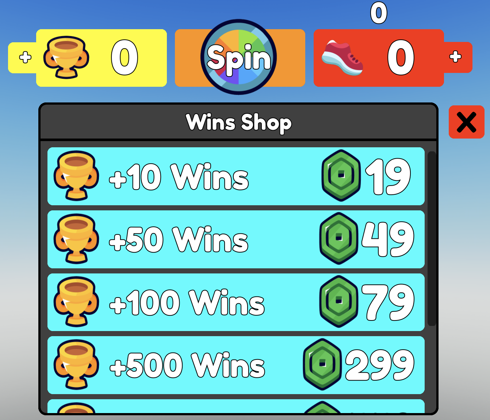

# Roblox Scripting Portfolio – Gattszu

Hi, I’m Gattszu 👋  
I’m a Roblox scripter specialising in gameplay systems, data handling, and UI logic.  
I focus on building **clean, modular, and efficient** systems that can be easily integrated into your game.

---

## 💼 Showcase

Each system below links to documentation/code and potentially a youtube video showcasing it

---

### 🐾 Pet System

  

  <a href="https://www.youtube.com/watch?v=NcmDej2jaSU">
    Watch the demo
  </a>

**Features:**
- Hatch pets with animation  
- Equip/unequip with unique IDs  
- Delete pets safely  
- DataStore saving/loading  

**Links:**  
[View Code](https://github.com/Gattszu/Portfolio/tree/main/PetSystem) | [Try Live Demo](https://www.roblox.com/games/106083918695359/Pet-System-Showcase)
---

### 🛒 Shop Feature

  <table>
    <tr>
      <td></td>
      <td></td> 
    </tr>
  </table>

  <a href="https://youtu.be/aEUMjJX5TuM">
    Watch the demo
  </a>

**Demonstrates:**
- Implementing of dev products
- Clean Professional UI
- Clean modular, easily integratable design  

**Links:**  
[View Code](https://github.com/Gattszu/Portfolio/tree/main/ShopFeature) 

---

### 🗄️ Data Systems
**Features:**
- Player data saving/loading  
- Error handling & retries  
- Scalable module-based structure  

**Links:**  
[View Code](https://github.com/Gattszu/Portfolio/tree/main/DataFolder/Project1Folder) 

---

## 📩 Commissions
- 💰 Pricing: Depends on project scope (contact me for quotes)  
- ⏱️ Turnaround: Usually 3–5 days per system  
- 📬 Contact:  
  - Twitter/X: [@GattszuRBLX](https://x.com/GattszuRBLX)  
  - Discord: `@Gattszu.`  
